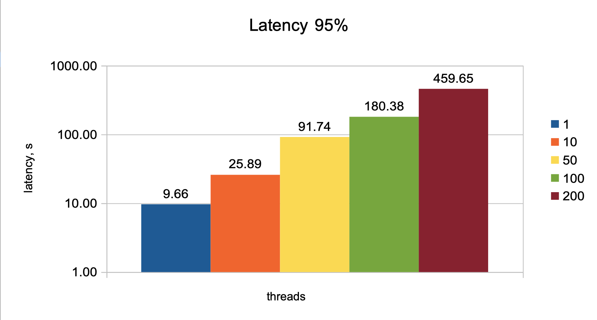
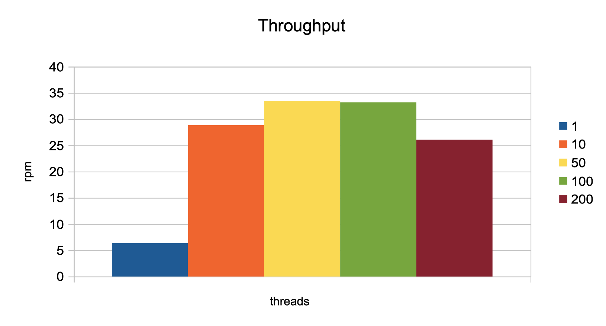
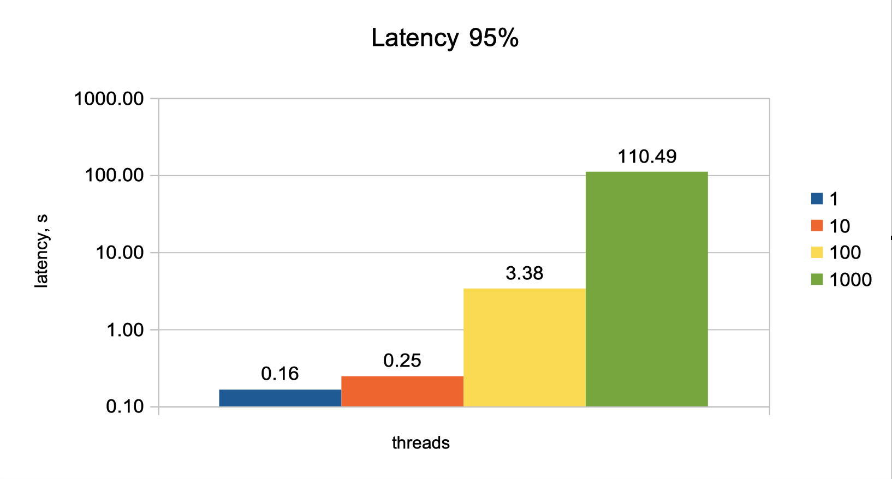

# Замеры до индекса:

## Latency 95 percentile:


## Throughput


## План запроса:

```sql
explain analyze select * from users where
    first_name like 'ива%' and second_name like 'петро%';
```

```
-> Filter: ((users.first_name like 'ива%') and (users.second_name like 'петро%'))  (cost=77372.71 rows=9075) (actual time=23621.431..33919.043 rows=258 loops=1)
     -> Table scan on users  (cost=77372.71 rows=735226) (actual time=0.730..21984.014 rows=1000000 loops=1)
```

# Замеры с индексом:

## Добавляем индекс 
```sql
create index first_second_name_IDX on users (`first_name`, `second_name`) USING BTREE;
```

## Latency 95 percentile:


## Throughput


## План запроса:

```sql
explain analyze select * from users where
    first_name like 'ива%' and second_name like 'петро%';
```

```
-> Index range scan on users using users_first_second_name_IDX over ('ива' <= first_name <= 'ива􏿿􏿿􏿿􏿿􏿿􏿿􏿿􏿿􏿿􏿿􏿿􏿿􏿿􏿿􏿿􏿿􏿿􏿿􏿿􏿿􏿿􏿿􏿿􏿿􏿿􏿿􏿿􏿿􏿿􏿿􏿿􏿿􏿿􏿿􏿿􏿿􏿿􏿿􏿿􏿿􏿿􏿿􏿿􏿿􏿿􏿿􏿿􏿿􏿿􏿿􏿿􏿿􏿿􏿿􏿿􏿿􏿿􏿿􏿿􏿿􏿿􏿿􏿿􏿿􏿿􏿿􏿿􏿿􏿿􏿿􏿿􏿿􏿿􏿿􏿿􏿿􏿿􏿿􏿿􏿿􏿿􏿿􏿿􏿿􏿿􏿿􏿿􏿿􏿿􏿿􏿿􏿿􏿿􏿿􏿿􏿿􏿿􏿿􏿿􏿿􏿿􏿿􏿿􏿿􏿿􏿿􏿿􏿿􏿿􏿿􏿿􏿿􏿿􏿿􏿿􏿿􏿿􏿿􏿿􏿿􏿿􏿿􏿿􏿿􏿿􏿿􏿿􏿿􏿿􏿿􏿿􏿿􏿿􏿿􏿿􏿿􏿿􏿿􏿿􏿿􏿿􏿿􏿿􏿿􏿿􏿿􏿿􏿿􏿿􏿿􏿿􏿿􏿿􏿿􏿿􏿿􏿿􏿿􏿿􏿿􏿿􏿿􏿿􏿿􏿿􏿿􏿿􏿿􏿿􏿿􏿿􏿿􏿿􏿿􏿿􏿿􏿿􏿿􏿿􏿿􏿿􏿿􏿿􏿿􏿿􏿿􏿿􏿿􏿿􏿿􏿿􏿿􏿿􏿿􏿿􏿿􏿿􏿿􏿿􏿿􏿿􏿿􏿿􏿿􏿿􏿿􏿿􏿿􏿿􏿿􏿿􏿿􏿿􏿿􏿿􏿿􏿿􏿿􏿿􏿿􏿿􏿿􏿿􏿿􏿿􏿿􏿿􏿿􏿿􏿿􏿿􏿿􏿿􏿿􏿿􏿿􏿿􏿿􏿿􏿿􏿿􏿿􏿿􏿿􏿿􏿿􏿿􏿿􏿿􏿿􏿿􏿿' AND 'петро' <= second_name <= 'петро􏿿􏿿􏿿􏿿􏿿􏿿􏿿􏿿􏿿􏿿􏿿􏿿􏿿􏿿􏿿􏿿􏿿􏿿􏿿􏿿􏿿􏿿􏿿􏿿􏿿􏿿􏿿􏿿􏿿􏿿􏿿􏿿􏿿􏿿􏿿􏿿􏿿􏿿􏿿􏿿􏿿􏿿􏿿􏿿􏿿􏿿􏿿􏿿􏿿􏿿􏿿􏿿􏿿􏿿􏿿􏿿􏿿􏿿􏿿􏿿􏿿􏿿􏿿􏿿􏿿􏿿􏿿􏿿􏿿􏿿􏿿􏿿􏿿􏿿􏿿􏿿􏿿􏿿􏿿􏿿􏿿􏿿􏿿􏿿􏿿􏿿􏿿􏿿􏿿􏿿􏿿􏿿􏿿􏿿􏿿􏿿􏿿􏿿􏿿􏿿􏿿􏿿􏿿􏿿􏿿􏿿􏿿􏿿􏿿􏿿􏿿􏿿􏿿􏿿􏿿􏿿􏿿􏿿􏿿􏿿􏿿􏿿􏿿􏿿􏿿􏿿􏿿􏿿􏿿􏿿􏿿􏿿􏿿􏿿􏿿􏿿􏿿􏿿􏿿􏿿􏿿􏿿􏿿􏿿􏿿􏿿􏿿􏿿􏿿􏿿􏿿􏿿􏿿􏿿􏿿􏿿􏿿􏿿􏿿􏿿􏿿􏿿􏿿􏿿􏿿􏿿􏿿􏿿􏿿􏿿􏿿􏿿􏿿􏿿􏿿􏿿􏿿􏿿􏿿􏿿􏿿􏿿􏿿􏿿􏿿􏿿􏿿􏿿􏿿􏿿􏿿􏿿􏿿􏿿􏿿􏿿􏿿􏿿􏿿􏿿􏿿􏿿􏿿􏿿􏿿􏿿􏿿􏿿􏿿􏿿􏿿􏿿􏿿􏿿􏿿􏿿􏿿􏿿􏿿􏿿􏿿􏿿􏿿􏿿􏿿􏿿􏿿􏿿􏿿􏿿􏿿􏿿􏿿􏿿􏿿􏿿􏿿􏿿􏿿􏿿􏿿􏿿􏿿􏿿􏿿􏿿􏿿􏿿􏿿􏿿'), with index condition: ((users.first_name like 'ива%') and (users.second_name like 'петро%'))  (cost=36817.47 rows=34590) (actual time=9.499..17.681 rows=258 loops=1)
```

