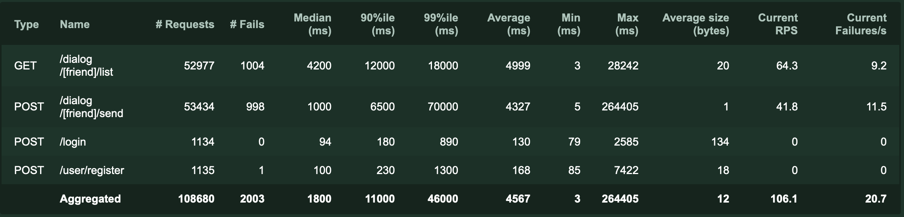
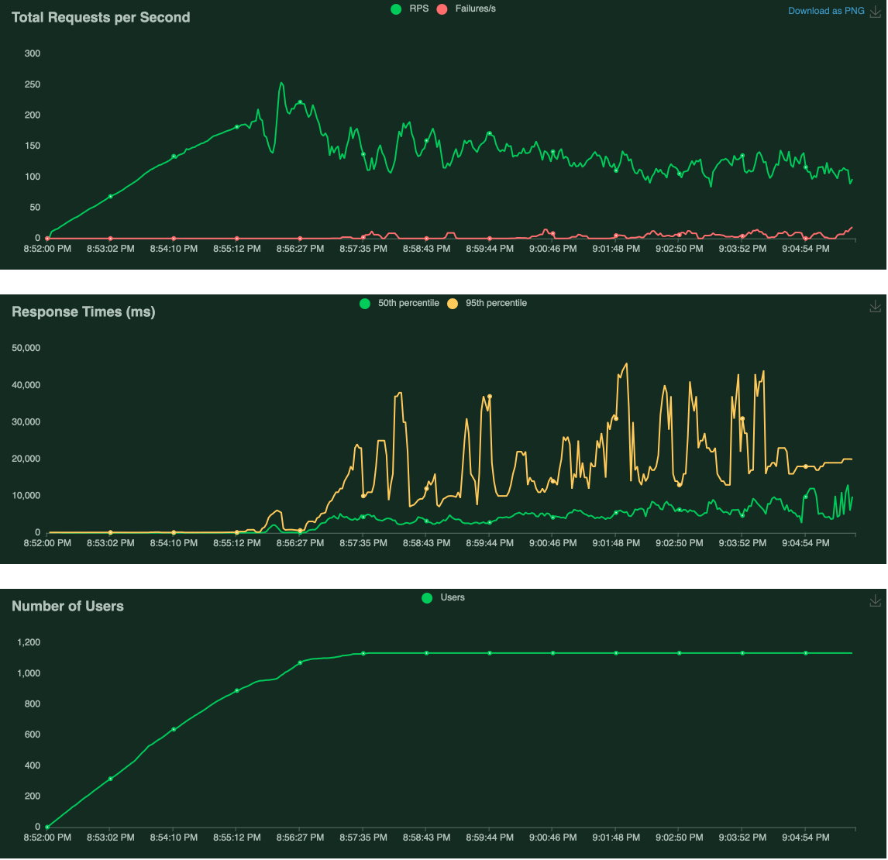
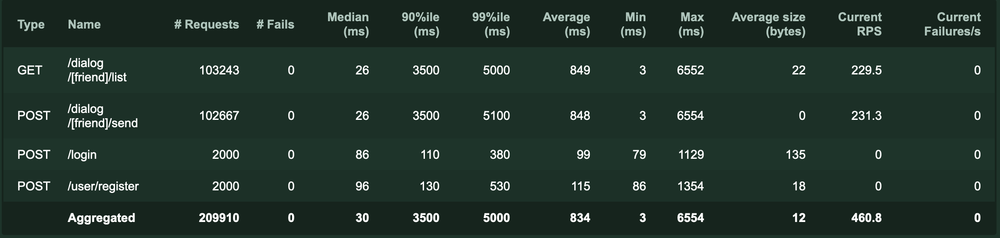
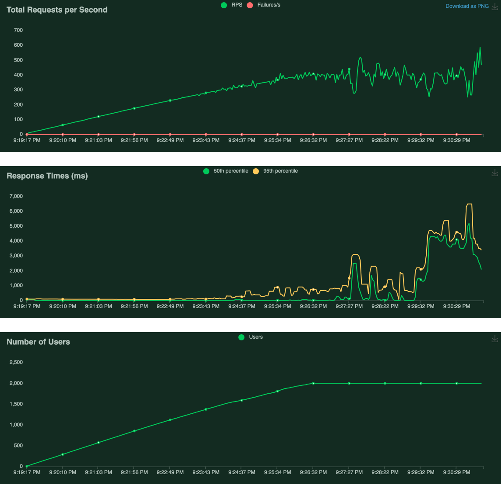

# Подготовка

```
pip install -r requirements.txt
```

# Тест план

1. Скрипт для нагрузочного тестирования создает и авторизует 2000 пользователей
2. Каждый пользователь ведет диалог с 50 друзьями
3. Раз в 5 секунд пользователь или отправляет сообщение одному из своих друзей или запрашивает историю диалога
4. Время выполнения скрипта 10 минут

# Запуск нагрузочного тестирования
```
locust -f test/load/dialog_locustfile.py --run-time 10m --users 2000 --dialog-friends=50 --spawn-rate 100
```
Тестирование запускается через веб интерфейс http://localhost:8089/

# Нагрузочное тестирование диалогов в MySQL

## Запуск приложения
```bash
IN_MEMORY_DIALOG_ENABLED=false docker-compose -f docker-compose.yml up -d
```

## Результаты



Потребление ресурсов
```
docker stats

CONTAINER ID   NAME                             CPU %     MEM USAGE / LIMIT     MEM %     NET I/O           BLOCK I/O         PIDS
bbd4d9340943   highload_architect-rabbitmq-1    0.17%     123MiB / 7.773GiB     1.55%     9.93kB / 7.6kB    8.29MB / 573kB    30
32a3b21e898c   highload_architect-db-1          229.25%   624.2MiB / 7.773GiB   7.84%     24.4MB / 30.5MB   11.5MB / 504MB    58
d5d9162320a8   highload_architect-tarantool-1   0.10%     6.48MiB / 7.773GiB    0.08%     1.61kB / 0B       8.19kB / 20.5kB   4
75ea1f5e4cf6   highload_architect-app-1         92.76%    52.31MiB / 7.773GiB   0.66%     48.4MB / 32.9MB   0B / 0B           13
```

## Остановка приложения и очистка
```bash
IN_MEMORY_DIALOG_ENABLED=false docker-compose -f docker-compose.yml down
docker volume rm $(docker volume ls -q)
```

# Нагрузочное тестирование диалогов в Tarantool

## Запуск приложения
```bash
docker-compose -f docker-compose.yml up -d
```

## Результаты



Потребление ресурсов
```
docker stats

CONTAINER ID   NAME                             CPU %     MEM USAGE / LIMIT     MEM %     NET I/O           BLOCK I/O        PIDS
d76ed017ccd3   highload_architect-app-1         53.29%    72.28MiB / 7.773GiB   0.91%     125MB / 84.5MB    0B / 0B          13
aee309d6f238   highload_architect-db-1          1.32%     389.5MiB / 7.773GiB   4.89%     1.56MB / 3.33MB   520kB / 336MB    39
798f55ed1028   highload_architect-tarantool-1   23.09%    18.16MiB / 7.773GiB   0.23%     49.1MB / 40.8MB   0B / 5.68MB      4
06fee8d65748   highload_architect-rabbitmq-1    0.21%     115.2MiB / 7.773GiB   1.45%     13.4kB / 10.6kB   16.4kB / 586kB   30
```

## Остановка приложения и очистка
```bash
docker-compose -f docker-compose.yml down
docker volume rm $(docker volume ls -q)
```
